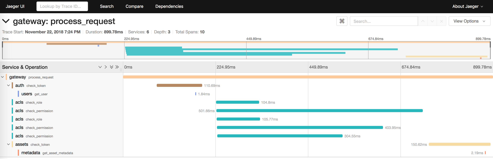

# Jaeger tracing example with python (Flask and aiohttp)
Jaeger Distributed Tracing Python (Flask, aiohttp) Example

# Installation

    pip install -r requirements.txt

# Running

First of all you need to run jaeger all in one daemon. In my case I just downloaded compiled binary from https://www.jaegertracing.io/download/ and run it like this:

    > $ ./jaeger-all-in-one
    {"level":"info","ts":1542910843.7501152,"caller":"healthcheck/handler.go:99","msg":"Health Check server started","http-port":14269,"status":"unavailable"}
    {"level":"info","ts":1542910843.7517068,"caller":"memory/factory.go:55","msg":"Memory storage configuration","configuration":{"MaxTraces":0}}
    {"level":"info","ts":1542910843.7518651,"caller":"static/strategy_store.go:77","msg":"No sampling strategies provided, using defaults"}
    {"level":"info","ts":1542910843.755409,"caller":"tchannel/builder.go:94","msg":"Enabling service discovery","service":"jaeger-collector"}
    {"level":"info","ts":1542910843.7555032,"caller":"peerlistmgr/peer_list_mgr.go:111","msg":"Registering active peer","peer":"127.0.0.1:14267"}
    {"level":"info","ts":1542910843.756171,"caller":"all-in-one/main.go:194","msg":"Starting agent"}
    {"level":"info","ts":1542910843.757705,"caller":"all-in-one/main.go:234","msg":"Starting jaeger-collector TChannel server","port":14267}
    {"level":"info","ts":1542910843.757814,"caller":"all-in-one/main.go:244","msg":"Starting jaeger-collector HTTP server","http-port":14268}
    {"level":"info","ts":1542910844.08499,"caller":"all-in-one/main.go:313","msg":"Registering metrics handler with jaeger-query HTTP server","route":"/metrics"}
    {"level":"info","ts":1542910844.085044,"caller":"all-in-one/main.go:319","msg":"Starting jaeger-query HTTP server","port":16686}
    {"level":"info","ts":1542910844.085066,"caller":"healthcheck/handler.go:133","msg":"Health Check state change","status":"ready"}
    {"level":"info","ts":1542910844.759163,"caller":"peerlistmgr/peer_list_mgr.go:157","msg":"Not enough connected peers","connected":0,"required":1}
    {"level":"info","ts":1542910844.759978,"caller":"peerlistmgr/peer_list_mgr.go:166","msg":"Trying to connect to peer","host:port":"127.0.0.1:14267"}
    {"level":"info","ts":1542910844.76654,"caller":"peerlistmgr/peer_list_mgr.go:176","msg":"Connected to peer","host:port":"[::]:14267"}

#### Terminal 1
    > $ python gateway.py

#### Terminal 2
    > $ python metadata.py

#### Terminal 3
    > $ python acl.py

#### Terminal 4
    > $ python users.py

#### Terminal 5
    > $ python auth.py

#### Terminal 6
    > $ python assets.py

Then you can call this http://localhost:8080/assets/1/ using curl or open it in a browser.

    > $ curl http://localhost:8080/assets/1/
    {"id": 1, "metadata": {"date_created": "2018-11-22T19:25:27.364722", "status": "CLOSED", "title": "Asset 1"}, "name": "Asset 1"}%

After that you can open http://localhost:16686 in your browser and check the tracing results. It should look like this:

